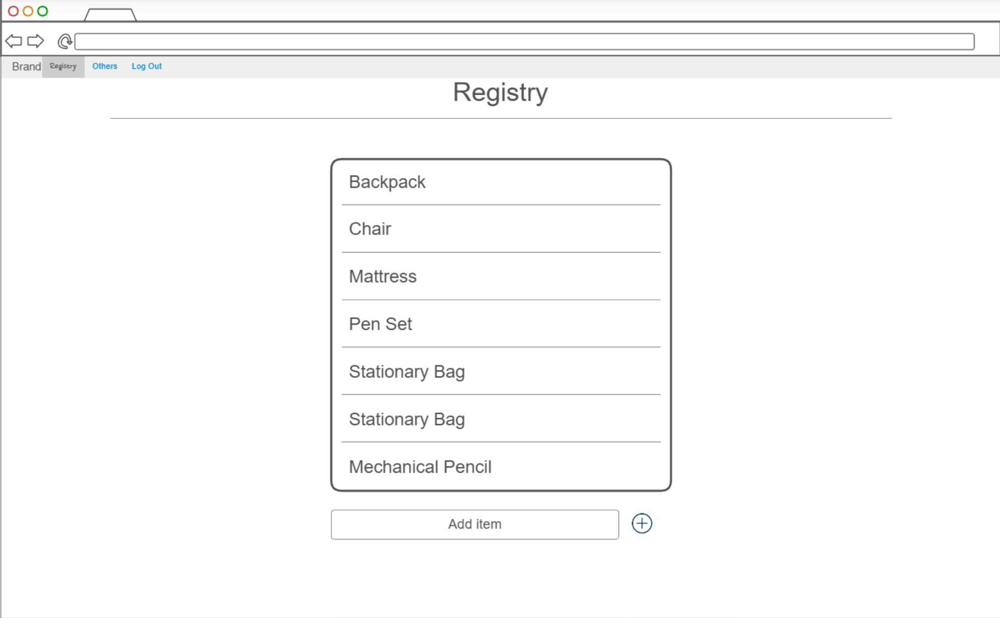
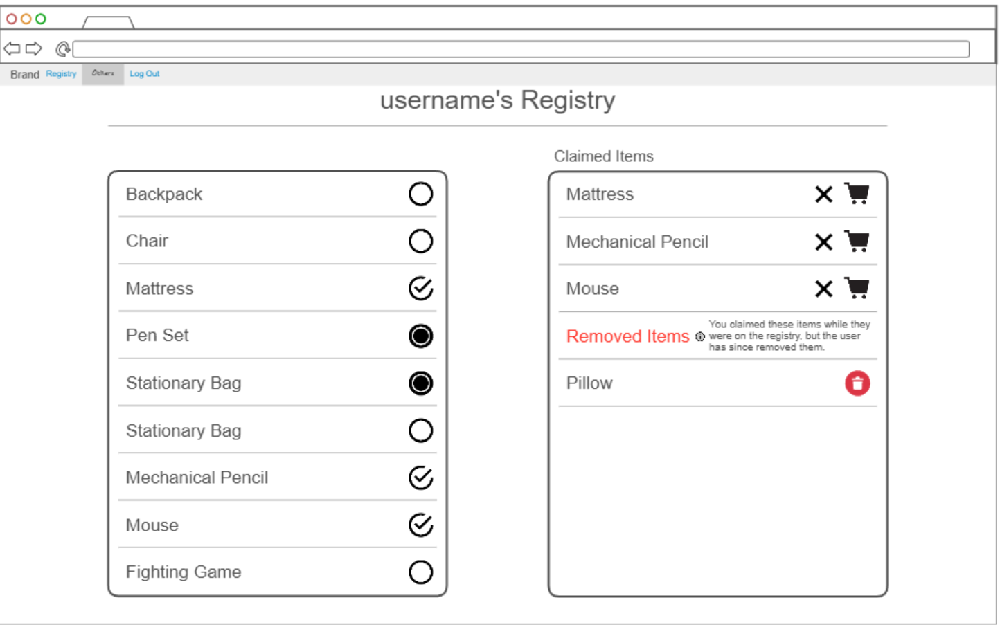

# Registry

[My Notes](notes.md)

A registry which will allow people to make a list of things they want, then see what other people want and claim them in order to purchase them as gifts.

> [!NOTE]
>  This is a template for your startup application. You must modify this `README.md` file for each phase of your development. You only need to fill in the section for each deliverable when that deliverable is submitted in Canvas. Without completing the section for a deliverable, the TA will not know what to look for when grading your submission. Feel free to add additional information to each deliverable description, but make sure you at least have the list of rubric items and a description of what you did for each item.

> [!NOTE]
>  If you are not familiar with Markdown then you should review the [documentation](https://docs.github.com/en/get-started/writing-on-github/getting-started-with-writing-and-formatting-on-github/basic-writing-and-formatting-syntax) before continuing.

## 🚀 Specification Deliverable

> [!NOTE]
>  Fill in this sections as the submission artifact for this deliverable. You can refer to this [example](https://github.com/webprogramming260/startup-example/blob/main/README.md) for inspiration.

For this deliverable I did the following. I checked the box `[x]` and added a description for things I completed.

- [x] Proper use of Markdown - I read the GitHub page and everything.
- [x] A concise and compelling elevator pitch
- [x] Description of key features
- [x] Description of how you will use each technology
- [x] One or more rough sketches of your application. Images must be embedded in this file using Markdown image references.

### Elevator pitch

For many, gift giving--and receiving--isn't as fun as others make it out to be. It can be hard to pick out the right gift for a person, and it is all too common that someone receieves a gift that they didn't want or need--or, yet worse, they receive something that they already had! The Registry application simplifies this process: people will be able to create lists of things that they want as gifts and others will be able to view and claim these gifts to buy. Think of it as somehwat similar to other registries, but constantly up and ready to be used. This ensures that one can purchase the gifts that their friends and family actually want.

### Design

These images display mockups for two of the most essential and unique aspects of this application. The first shows the creation of one's own registry, which can have a variety of gifts that one adds to. The second shows someone viewing another user's registry. There are different icons to demonstrate if the item is available, claimed by the logged in user, or claimed by another user, a list of claimed items, and a list of items which one may have claimed previously but which the viewed user has since removed from their registry.

### Key features

- Secure login over HTTPS
- Secure account creation
- Ability to add and remove items from personal registry
- Registries stored in database
- Ability to search for other users
- View other users' registries
- Claim certain items from other users registries
- Mark claimed items as bought, or discard claim
- View all claimed items

### Technologies

I am going to use the required technologies in the following ways.

- **HTML** - Uses correct HTML structure for application. At least three HTML pages. One for login, one for viewing own registry, one for viewing the registries of others. Potential fourth for viewing a total list of claimed items.
- **CSS** - Application styling that looks good on different screen sizes, uses good whitespace, color choice and contrast. Iconography which makes it clear to the user what each action means.
- **React** - Provides login, display of both personal registry and others', ability to select and unselect items from registry, and ability to mark items as purchased. 
- **Service** - Backend service with endpoints for:
    - login
    - retrieving registries and each items' status
    - call to isDayOff() API to remind the user how many days there are until the next public holiday
    - changing registries, including:
        - changing ones own registry by adding or deleting items
        - marking others' items as claimed or unclaimed
- **DB/Login** - Register, login, and logout users. Store users and registries in a database. Credentials securely stored in database. Can't view others' registries unless authenticated.
- **WebSocket** - As changes are made to a registry, other users can see these changes.

## 🚀 AWS deliverable

For this deliverable I did the following. I checked the box `[x]` and added a description for things I completed.

- [x] **Server deployed and accessible with custom domain name** - [My server link](https://sethsquires.com).

## 🚀 HTML deliverable

For this deliverable I did the following. I checked the box `[x]` and added a description for things I completed.

- [x] **HTML pages** - I made four different HTML pages
- [x] **Proper HTML element usage** - I have made different HTML elements in proper structure.
- [x] **Links** - I have links to the other parts of the web page.
- [x] **Text** - There is proper use of text
- [x] **3rd party API placeholder** - There is a placeholder to the 3rd party API in index.html
- [x] **Images** - There are trash can images
- [x] **Login placeholder** - There is a login placeholder
- [x] **DB data placeholder** - the my-registry page holds this placeholder
- [x] **WebSocket placeholder** - The view-registry page holds this placeholder

## 🚀 CSS deliverable

For this deliverable I properly styled the application into its final appearance. I changed the list of things to complete in accordance with the assignment.

- [x] I completed the prerequisites for this deliverable (Simon deployed, GitHub link, Git commits)
- [x] **Visually appealing colors and layout. No overflowing elements.** - Looks great to me. Tables might require more formatting, but I was satisfied with how they seemed.
- [x] **Use of a CSS framework** - I used Bootstrap
- [x] **All visual elements styled using CSS** - Yep!
- [x] **Responsive to window resizing using flexbox and/or grid display** I tested each screen on a variety of different window sizes, using flexbox
- [x] **Use of a imported font** - I used sans serif in accordance with Bootstrap
- [x] **Use of different types of selectors including element, class, ID, and pseudo selectors** - Used them all. I believe all are in [main.css](main.css), if not there are other examples in [view-registry.css](view-registry.css)

## 🚀 React part 1: Routing deliverable

For this deliverable I did the following. I checked the box `[x]` and added a description for things I completed.

- [ ] **Bundled using Vite** - I did not complete this part of the deliverable.
- [ ] **Components** - I did not complete this part of the deliverable.
- [ ] **Router** - I did not complete this part of the deliverable.

## 🚀 React part 2: Reactivity deliverable

For this deliverable I did the following. I checked the box `[x]` and added a description for things I completed.

- [ ] **All functionality implemented or mocked out** - I did not complete this part of the deliverable.
- [ ] **Hooks** - I did not complete this part of the deliverable.

## 🚀 Service deliverable

For this deliverable I did the following. I checked the box `[x]` and added a description for things I completed.

- [ ] **Node.js/Express HTTP service** - I did not complete this part of the deliverable.
- [ ] **Static middleware for frontend** - I did not complete this part of the deliverable.
- [ ] **Calls to third party endpoints** - I did not complete this part of the deliverable.
- [ ] **Backend service endpoints** - I did not complete this part of the deliverable.
- [ ] **Frontend calls service endpoints** - I did not complete this part of the deliverable.
- [ ] **Supports registration, login, logout, and restricted endpoint** - I did not complete this part of the deliverable.

## 🚀 DB deliverable

For this deliverable I did the following. I checked the box `[x]` and added a description for things I completed.

- [ ] **Stores data in MongoDB** - I did not complete this part of the deliverable.
- [ ] **Stores credentials in MongoDB** - I did not complete this part of the deliverable.

## 🚀 WebSocket deliverable

For this deliverable I did the following. I checked the box `[x]` and added a description for things I completed.

- [ ] **Backend listens for WebSocket connection** - I did not complete this part of the deliverable.
- [ ] **Frontend makes WebSocket connection** - I did not complete this part of the deliverable.
- [ ] **Data sent over WebSocket connection** - I did not complete this part of the deliverable.
- [ ] **WebSocket data displayed** - I did not complete this part of the deliverable.
- [ ] **Application is fully functional** - I did not complete this part of the deliverable.
